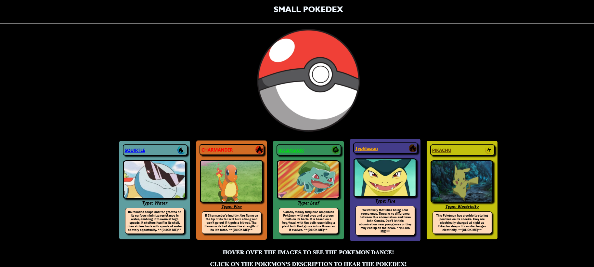

## ⛅ Mini Pokedex Project:

- A mini Pokédex that displays Pokémon cards with animated interactions.

## 😧 Features:
- 🎭 Hover Effect: Hovering over Pokémon images makes them dance.
- 🔊 Click for Pokédex Entry: Clicking on a Pokémon’s description plays its Pokédex entry audio with the authentic Pokédex voice actor.
- 🎨 Themed Design: Pokémon cards are color-coded based on their element types (Water, Fire, Leaf, Electricity etc.).
- 🖼️ Large Pokéball: A large Pokéball icon is centered at the top for aesthetic appeal and hovering over it makes the ball shake.
- ⚡ Interactive UI: Smooth animations and effects bring the Pokémon world to life.

##  📸 Screenshot: 
- 

##  🌍 LIVE DEMO:
- Try it Out: https://chrisw0987.github.io/Mini-Pokedex/

## 🛠 Tech Stack:
- **Frontend:** React.js, Vite
- **Styling:** CSS, Animations
- **Tools**: GitHub, VS Code


## 📦 Installation:
1. Clone the repository:
   ```bash
   git clone https://chrisw0987.github.io/Mini-Pokedex/
2. cd Mini-Pokedex
3. npm install
4. npm run dev